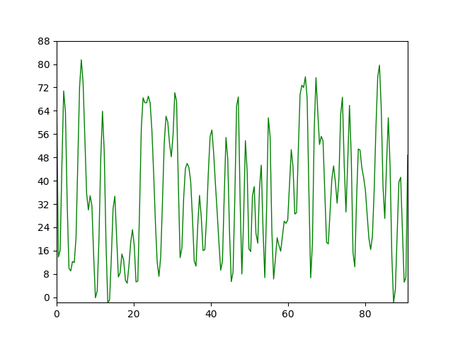
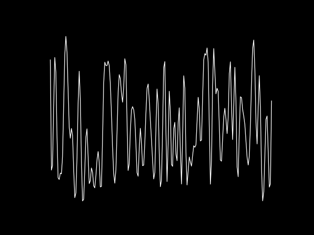
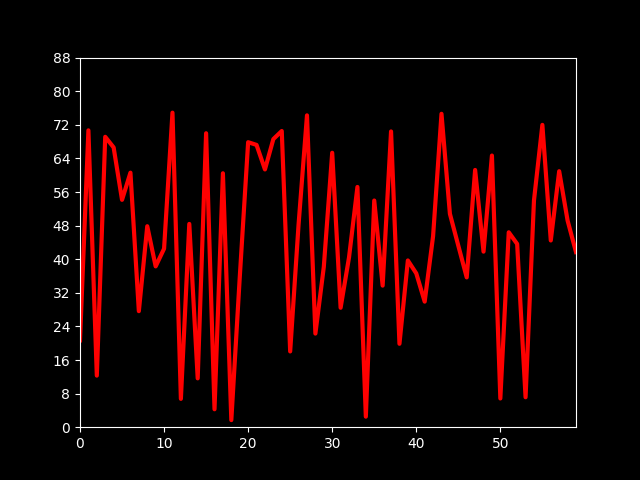
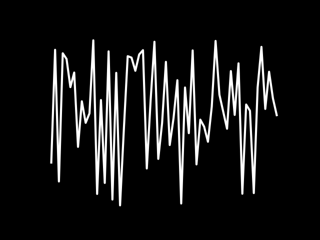

# CurveFigureAnalysis

## 1.introduction

### It's a project target at extracting the line figure from the picture

For example

#### Change the pic to a binary pic:

We tend to get a picture containing targeted line info, and after process we could get a binary picture.

The picture could be multicolored and having strong noise.

See below two example: 

| pic type                    | input                                                | output                                                    |
| --------------------------- | ---------------------------------------------------- | --------------------------------------------------------- |
| the normal background color |  |  |
| the black background color  |  |  |
| the real word background    |                                                      |                                                           |

## 2.basic function

### (1)read in the pics of Curve or BrokenLine.

After we get the binary pictures, we have several method

### (2)return the functions or points of the figure.

##### 1)in excel mode

### (3)figure extraction.

### (4)Other mode

##### 1.Extraction of scatters

##### 2.Extraction of hists

## 3.tech used

### (1)basic introduce of figure extraction

We use three techs to detect the figure,for different compute power

#### 1)Using traditional color divide method

Basically we calc the color info and decide which color is the line color.

And through canny and sobel method we also get the processed pic.
Finally, we judge the quality of several pic, and return.

#### 2)Using machine learn the filter color

#### 3)Using HED to detect the edge

### (2)Points extraction

#### 1)scipy.signal process

We assume that our curve is a signal, and using the low filter to smooth the curve.

## 4.tutorial

### (1)Using python API

    from LineFigure import LineFgure
    from BrokenLineFigure import BrokenLinrFigure

We define the class of "LineFigure",and subclasses such as 
BrokenLineFigure and CurveFigure for more detail process

### (2)Using website

We build a website for a more portable usage.

## 5.Acknowledgement

### papers:

#### For more information:

contact us via e-mail: 8203200527@csu.edu.cn
